# FAISS-Powered RAG System with Llama 3.1

A high-performance Retrieval-Augmented Generation (RAG) system that uses FAISS for vector search and Llama 3.1 (via Ollama) for embeddings and text generation. This system allows you to ingest web content and ask questions about it, with the model providing contextually relevant answers.

## System Architecture

```mermaid
  flowchart TD
    %% Define contrast for readability
    classDef ingestion fill:#004466,stroke:#002233,stroke-width:2px,color:#ffffff
    classDef storage fill:#663399,stroke:#442266,stroke-width:2px,color:#ffffff
    classDef retrieval fill:#994400,stroke:#662200,stroke-width:2px,color:#ffffff
    classDef generation fill:#8B0000,stroke:#600000,stroke-width:2px,color:#ffffff
    classDef explain fill:#f4f4f4,stroke:#888888,stroke-width:1px,font-style:italic

    subgraph Setup["⚙️ 1. System Initialization"]
        A["🛠️ Load NLTK, FAISS, Ollama"] --> B["📁 Create FAISS Index"]
        B --> C["⚡ Enable GPU (if available)"]
        C --> D["🗂️ Load existing index (if available)"]
        E["📝 **Process:**<br>1. Load required libraries<br>2. Initialize FAISS (CPU/GPU)<br>3. Prepare metadata storage"]:::explain
    end
    
    subgraph Ingestion["📥 2. Content Ingestion"]
        F["🌐 Fetch Webpage (requests)"] --> G["🛠️ Process HTML (BeautifulSoup)"]
        G --> H["📜 Extract & Clean Text"]
        H --> I["🔀 Chunking (Semantic Boundaries)"]
        J["📝 **Process:**<br>1. Fetch page<br>2. Remove unnecessary elements<br>3. Split into meaningful chunks"]:::explain
    end
    
    subgraph Embedding["📊 3. Vector Embeddings"]
        I --> K["🔢 Generate Embeddings (Ollama)"]
        K --> L["🗃️ Cache Embeddings (Avoid redundant calls)"]
        L --> M["📂 Add Vectors to FAISS Index"]
        N["📝 **Process:**<br>1. Convert chunks to vectors<br>2. Store in FAISS<br>3. Use caching for efficiency"]:::explain
    end
    
    subgraph Storage["💾 4. Index & Metadata Storage"]
        M --> O["💾 Save FAISS Index"]
        M --> P["📋 Save Metadata (JSON)"]
        Q["📝 **Process:**<br>1. Store FAISS index on disk<br>2. Maintain metadata for retrieval"]:::explain
    end
    
    subgraph QueryProcessing["🔍 5. Query Processing"]
        R["❓ User Question"] --> S["🔢 Convert Question to Vector"]
        S --> T["🔎 Search FAISS Index"]
        O --> T
        T --> U["📚 Retrieve Top Matching Chunks"]
        P --> U
        V["📝 **Process:**<br>1. Encode query<br>2. Find closest vectors<br>3. Retrieve relevant text"]:::explain
    end
    
    subgraph Reranking["📊 6. Reranking Results"]
        U --> W["🧐 Compute Keyword Match Score"]
        U --> X["📍 Compute Position Score"]
        W --> Y["📊 Adjust Weighted Scores"]
        X --> Y
        Y --> Z["📜 Return Top-K Relevant Chunks"]
        AA["📝 **Process:**<br>1. Score relevance based on<br>- Vector similarity<br>- Keyword match<br>- Chunk position"]:::explain
    end
    
    subgraph Answer["💡 7. Answer Generation"]
        Z --> AB["📝 Construct Prompt with Context"]
        R --> AB
        AB --> AC["🤖 Generate Response (Ollama)"]
        AC --> AD["📩 Return User Response"]
        AE["📝 **Process:**<br>1. Build question-context prompt<br>2. Generate LLM response"]:::explain
    end
    
    %% Links between subgraphs
    Setup -.-> Ingestion
    Ingestion -.-> Embedding
    Embedding -.-> Storage
    Storage -.-> QueryProcessing 
    QueryProcessing -.-> Reranking
    Reranking -.-> Answer
    
    %% Apply class definitions
    class A,B,C,D,E setup
    class F,G,H,I,J ingestion
    class K,L,M,N embedding
    class O,P,Q storage
    class R,S,T,U,V retrieval
    class W,X,Y,Z,AA reranking
    class AB,AC,AD,AE generation
```



## Key Components

- **Vector Database**: FAISS (Facebook AI Similarity Search)
- **Language Model**: Llama 3.1:8B (via Ollama)
- **Embeddings**: Generated by Llama 3.1:8B through Ollama's embeddings API
- **Text Processing**: NLTK and BeautifulSoup
- **Vector Dimensions**: 4096-dimensional embeddings

## Dependencies

### Required Packages

```
poetry install
```


### Installing Ollama

1. Follow the instructions at [Ollama's official website](https://ollama.ai/download) to install Ollama for your platform.

2. Pull the Llama 3.1 8B model:
```bash
ollama pull llama3.1:8b
```

### Creating the Custom Model

The system uses a custom Ollama model called `crewai-llama-model`. To create this model:

1. Create a file named `ModelFile` with the following content:
```
FROM llama3.1:8b
PARAMETER temperature 0.1
PARAMETER num_ctx 8192
PARAMETER seed 42
PARAMETER top_p 0.9

SYSTEM """
You are an AI assistant that provides accurate, helpful, and concise answers based on the given context.
Your task is to analyze the provided context and answer questions based solely on that information.
If the context doesn't contain the answer, acknowledge that the information isn't available.
Always prioritize information from the provided context over your general knowledge.
"""
```

2. Create the model using the following command:
```bash
ollama create custom-llama-model -f MakeFile
```

3. Verify the model was created:
```bash
ollama list
```

This custom model uses Llama 3.1:8B as its base but is configured with specific parameters that optimize it for RAG tasks with lower temperature for more factual responses and increased context window.

## Running the System

### Basic Usage

1. Clone this repository:
```bash
git clone https://github.com/stay22/webrag22.git
cd webrag22
```

2. Install dependencies:
```bash
poetry install
```

3. Run the script:
```bash
python main.py
```

4. When prompted, enter a URL to analyze:
```
Enter a webpage URL: https://example.com/some-article
```

5. Ask questions about the content:
```
Ask a question (or type 'exit' to quit): What is the main topic of this article?
```

### Command Line Arguments

You can also run the script with a URL directly:
```bash
python main.py https://example.com/some-article
```

## Configuration Options

The system provides several configuration options that can be modified in the code:

- `chunk_size`: Size of text chunks in characters (default: 500)
- `chunk_overlap`: Overlap between chunks in characters (default: 100)
- `use_gpu`: Whether to use GPU for FAISS (default: False)
- `index_dir`: Directory to store FAISS indexes (default: "./faiss_indexes")

To enable GPU acceleration, install the GPU version of FAISS:
```bash
pip uninstall faiss-cpu
pip install faiss-gpu
```
Then set `use_gpu=True` when initializing the `WebRAG22` class.

## Detailed Process Flow


## Performance Optimizations

- **Embedding Caching**: Prevents redundant embedding generation
- **Batched Processing**: Processes chunks in groups for efficiency
- **FAISS for Vector Search**: Much faster than database-based vector search
- **Index Persistence**: Save/load capabilities to avoid reprocessing
- **Reranking**: Combines vector similarity, keyword matching, and position scoring

## Troubleshooting

### Common Issues

1. **"Failed to connect to Ollama server"**:
   - Make sure Ollama is running: `ollama serve`
   - Verify the model is downloaded: `ollama list`

2. **"Error saving index: maximum recursion depth exceeded"**:
   - This can happen with very large documents
   - Try decreasing the batch size in `generate_embeddings(batch_size=10)`

3. **Slow performance with large documents**:
   - Consider enabling GPU acceleration if you have a compatible GPU
   - Increase batch size for faster processing (if memory permits)

## Acknowledgments

- FAISS by Facebook Research: https://github.com/facebookresearch/faiss
- Ollama: https://github.com/ollama/ollama
- Llama 3.1 by Meta AI

